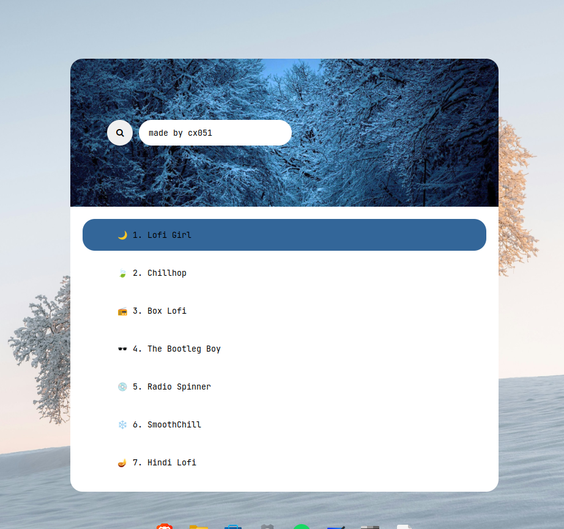

# ❄️ Rofi-Beats – Winter Frostline


**Rofi-Beats** is a winter-themed, minimalist lo-fi launcher for [Rofi](https://github.com/davatorium/rofi), bringing cozy beats to your keyboard-driven workflow 🌨️🎧.


---



## 🌟 Features

- 🎵 **Launch & control lo-fi beats** directly from Rofi  
- 🧊 **Winter-inspired minimalist workflow** for focus  
- ⌨️ **Fully keyboard-driven** – no mouse needed  
- 🔒 **Compiled binary** for easy distribution  
- 🎧 Uses **mpv** with **mpv-mpris** support  
- 🌙 Perfect for late-night coding or study sessions

  
🎵 Lightweight Lo-fi Music Player

- Minimal memory footprint: Uses only 70-100MB compared to Spotify's 600-700MB
- Perfect for low-end systems: Optimized for machines with 4GB RAM or less
- No lag, pure focus: Smooth performance without the bloat of streaming services 

---


## 📦 Requirements


Before running Rofi-Beats, make sure the following are installed:

### 1️⃣ System packages (APT)
```bash
sudo apt update
sudo apt install rofi mpv mpv-mpris
````


### 2️⃣ yt-dlp (Official GitHub release)

> ⚠️ Do **not** use the APT version – it may break functionality.

```bash
sudo wget https://github.com/yt-dlp/yt-dlp/releases/latest/download/yt-dlp -O /usr/local/bin/yt-dlp
sudo chmod +x /usr/local/bin/yt-dlp
yt-dlp --version
```

---


## 🛠️ Installation

```bash
# Clone repository
cd ~
git clone https://github.com/cx051/Rofi-Beats.git

# Navigate to project folder
cd ~/Rofi-Beats

# Make binary executable
chmod +x rofi-beats.x
```


---

## Usage

### Run from Terminal

```bash
./rofi-beats.x
```

### Bind to Keyboard Shortcut (Recommended ❄️)

1. Open **System Settings → Keyboard → Custom Shortcuts**
2. Add a new shortcut with:

   * **Command:** `~/Rofi-Beats/rofi-beats.x`
   * **Shortcut key:** e.g., `F2`
3. Enjoy lo-fi beats at a single keypress 🌨️🎶


## Shortcuts
Here's a quick rundown of the shortcuts you can use:

1. Esc Key: Just hit Esc to close the Rofi menu.
2. Up/Down Arrow Keys: Use the up and down arrows to navigate.
3. Your Custom Shortcut: Pressing your shortcut key will close the player.
4. Gnome Shortcut (Optional): Feel free to use your default Gnome shortcut to pause or play if you'd like!

   

---

## ⚡ Support & Future Plans

* Multiple new **themes** in development
* Workflow **enhancements** and **automation scripts**
* Star ⭐ to support future updates

Your support helps Winter Frostline grow 🌨️

---

---

## ❄️ Credits

**Created by:** cx051
**Inspired by:** adi1090x


